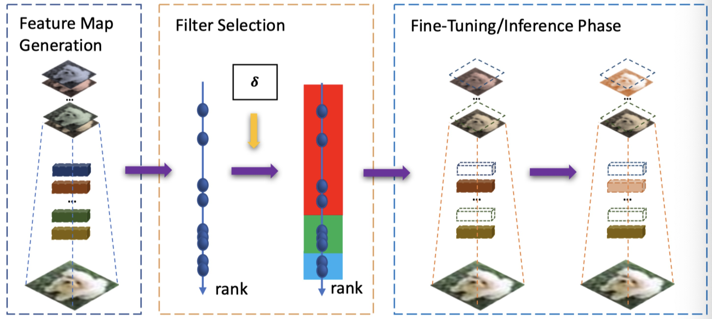

# HRank: Filter Pruning using High-Rank Feature Map ([Link](https://128.84.21.199/abs/2002.10179))

PyTorch implementation of HRank (CVPR 2020).


<div align=center></div>

Framework of HRank. In the left column, we first use images to run through the convolutional layers to get the feature maps. In the middle column, we then estimate the rank of each feature map, which is used as the criteria for pruning. The right column shows the pruning (the red filters), and fine-tuning where the green filters are updated and the blue filters are frozen.


## Tips

Any problem, please contact the authors via emails: lmbxmu@stu.xmu.edu.cn or ethan.zhangyc@gmail.com, or adding the first author's wechat as friends (id: lmbcxy if you are using wechat) for convenient communications. Do not post issues with github as much as possible, just in case that I could not receive the emails from github thus ignore the posted issues.


## Citation
If you find HRank useful in your research, please consider citing:

```
@inproceedings{lin2020hrank,   
  title     = {HRank: Filter Pruning using High-Rank Feature Map},
  author    = {Lin, Mingbao and Ji, Rongrong and Wang, Yan and Zhang, Yichen and Zhang, Baochang and Tian, Yonghong and Ling, Shao},
  booktitle = {Computer Vision and Pattern Recognition (CVPR)},
  year      = {2020}
}
```

## Running Code

In this code, you can run our models on CIFAR-10 and ImageNet dataset. The code has been tested by Python 3.6, Pytorch 1.0 and CUDA 9.0 on Ubuntu 16.04.


### Rank Generation

```shell
python rank_generation.py \
--resume [pre-trained model dir] \
--arch [model arch name] \
--limit [batch numbers] \
--gpu [gpu_id]

```


### Model Training

For the ease of reproducibility. we provide some of the experimental results and the corresponding pruned rate of every layer as belows:

##### 1. VGG-16

|  Params      | Flops         | Accuracy |
|--------------|---------------|----------|
| 2.64M(82.1%) | 108.61M(65.3%)| 92.34%   | 

```shell
python main.py \
--job_dir ./result/vgg_16_bn/[folder name] \
--resume [pre-trained model dir] \
--adjust_prune_ckpt \
--arch vgg_16_bn \
--compress_rate [0.05]+[0.5]*6+[0.1]*4+[0.2]*2 \
--gpu [gpu_id]
```
##### 2. ResNet56

|  Params      | Flops        | Accuracy |
|--------------|--------------|----------|
| 0.49M(42.4%) | 62.72M(50.0%)| 93.17%   | 

```shell
python main.py \
--job_dir ./result/resnet_56/[folder name] \
--resume [pre-trained model dir] \
--adjust_prune_ckpt \
--arch resnet_56 \
--compress_rate [0.1]+[0.60]*35+[0.0]*2+[0.6]*6+[0.4]*3+[0.1]+[0.4]+[0.1]+[0.4]+[0.1]+[0.4]+[0.1]+[0.4] \
--gpu [gpu_id]
```
##### 3. ResNet110

|  Params      | Flops        | Accuracy |
|--------------|--------------|----------|
| 1.04M(39.4%) |148.70M(41.2%)| 94.23%   | 

```shell
python main.py \
--job_dir ./result/resnet_110/[folder name] \
--resume [pre-trained model dir] \
--adjust_prune_ckpt \
--arch resnet_110 \
--compress_rate [0.1]+[0.40]*36+[0.40]*36+[0.4]*36 \
--gpu [gpu_id]
```
##### 4. DenseNet40

|  Params      | Flops        | Accuracy |
|--------------|--------------|----------|
| 0.66M(36.5%) |167.41M(40.8%)| 94.24%   | 

```shell
python main.py \
--job_dir ./result/densenet_40/[folder name] \
--resume [pre-trained model dir] \
--adjust_prune_ckpt \
--arch densenet_40 \
--compress_rate [0.0]+[0.1]*6+[0.7]*6+[0.0]+[0.1]*6+[0.7]*6+[0.0]+[0.1]*6+[0.7]*5+[0.0] \
--gpu [gpu_id]
```
##### 5. GoogLeNet

|  Params      | Flops        | Accuracy |
|--------------|--------------|----------|
| 1.86M(69.8%) |  0.45B(70.4%)| 94.07%   | 

```shell
python main.py \
--job_dir ./result/googlenet/[folder name] \
--resume [pre-trained model dir] \
--adjust_prune_ckpt \
--arch googlenet \
--compress_rate [0.10]+[0.8]*5+[0.85]+[0.8]*3 \
--gpu [gpu_id]
```
##### 6. ResNet50

|  Params | Flops| Acc Top1 |Acc Top5 |
|---------|------|----------|----------|
| 13.77M  |1.55B |    71.98%| 91.01% |

```shell
python main.py \
--dataset imagenet \
--data_dir [ImageNet dataset dir] \
--job_dir./result/resnet_50/[folder name] \
--resume [pre-trained model dir] \
--adjust_prune_ckpt \
--arch resnet_50 \
--compress_rate [0.2]+[0.8]*10+[0.8]*13+[0.55]*19+[0.45]*10 \
--gpu [gpu_id]
```

For multi-GPU training, make sure that CUDA\_VISIBLE\_DEVICES is being set at the very beginning.

After training, checkpoints and loggers can be found in the `job_dir`. The pruned model will be named `[arch]_cov[i]` for stage i, and therefore the final pruned model is the one with largest `i`.

### Get FLOPS & Params
```shell
python cal_flops_params.py \
--arch resnet_56_convwise \
--compress_rate [0.1]+[0.60]*35+[0.0]*2+[0.6]*6+[0.4]*3+[0.1]+[0.4]+[0.1]+[0.4]+[0.1]+[0.4]+[0.1]+[0.4]
```


## Other optional arguments
```
optional arguments:
    --data_dir			dataset directory
    				default='./data'
    --dataset			dataset name
    				default: cifar10
    				Optional: cifar10', imagenet
    --lr			initial learning rate
    				default: 0.01
    --lr_decay_step		learning rate decay step
				default: 5,10
    --adjust_prune_ckpt		adjust ckpt from pruned checkpoint
    --resume			load the model from the specified checkpoint
    --resume_mask		mask loading directory
    --gpu			Select gpu to use
    				default: 0
    --job_dir			The directory where the summaries will be stored.
    --epochs			The num of epochs to train.
    				default: 30
    --train_batch_size		Batch size for training.
    				default: 128
    --eval_batch_size		Batch size for validation. 
				default: 100
    --start_cov			The num of conv to start prune
    				default: 0
    --compress_rate 		compress rate of each conv
    --arch			The architecture to prune
    				default: vgg_16_bn
				Optional: resnet_50, vgg_16_bn, resnet_56, resnet_110, densenet_40, googlenet
```


## Pre-trained Models 

Additionally, we provide the pre-trained models used in our experiments. 


### CIFAR-10:
 [Vgg-16](https://drive.google.com/open?id=1i3ifLh70y1nb8d4mazNzyC4I27jQcHrE) 
| [ResNet56](https://drive.google.com/open?id=1f1iSGvYFjSKIvzTko4fXFCbS-8dw556T) 
| [ResNet110](https://drive.google.com/open?id=1uENM3S5D_IKvXB26b1BFwMzUpkOoA26m) 
| [DenseNet-40](https://drive.google.com/open?id=12rInJ0YpGwZd_k76jctQwrfzPubsfrZH) 
| [GoogLeNet](https://drive.google.com/open?id=1rYMazSyMbWwkCGCLvofNKwl58W6mmg5c) 

### ImageNet:
 [ResNet50](https://drive.google.com/open?id=1OYpVB84BMU0y-KU7PdEPhbHwODmFvPbB)
